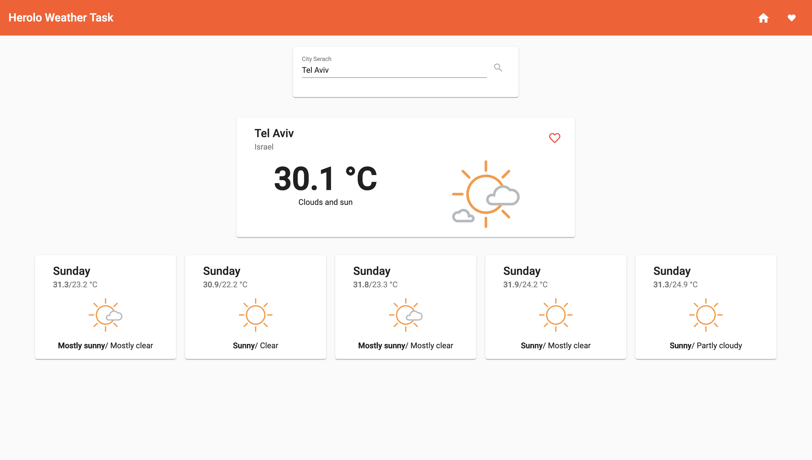
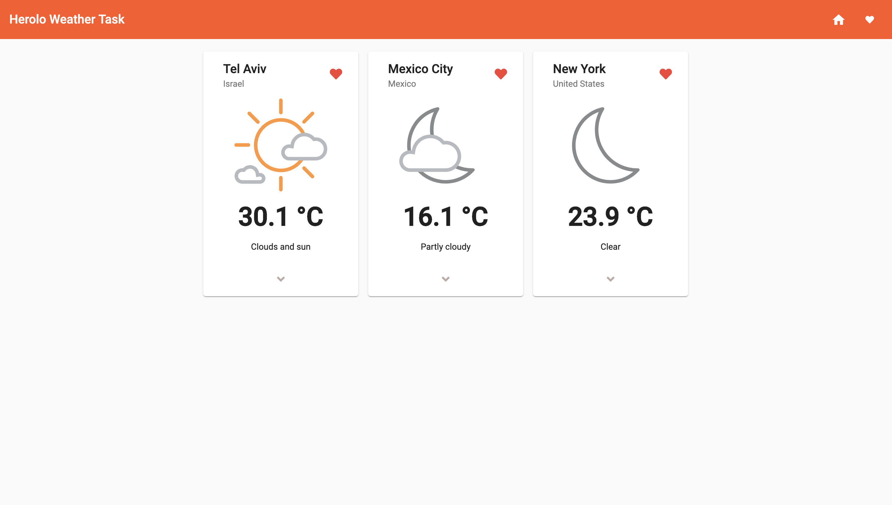
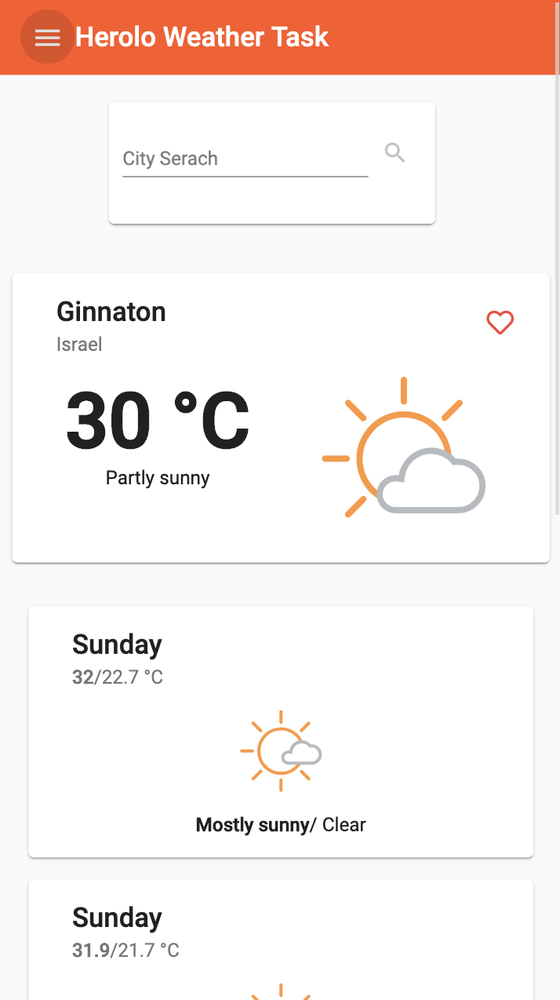
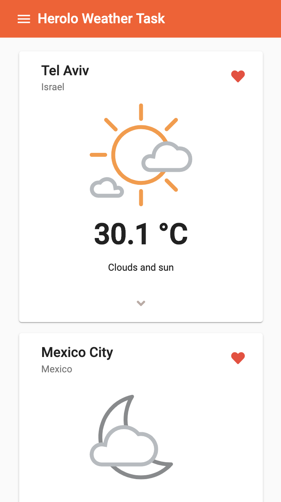

# Herolo Weather Hometask

## Description

Home task from [herolo](https://herolo.co.il) to create responsive weather application in angular.

### Stack

- Angular 7
- NgRX (State managment using selectors, reducers, actions and effects)
- Angular Material
- Angular Flex Layout (Flexbox)
- Font Awesome

### APIs

- [AccuWeather Developer API](https://developer.accuweather.com)
- [GeoLocation API](https://developer.mozilla.org/en-US/docs/Web/API/Geolocation_API)

### Run local

**Steps**

```bash
git clone https://github.com/yuvalbit/Yuval-Bitan-25-07-2019.git herolo-hometask
cd herolo-hometask
npm install
ng serve
```

and then navigate to http://localhost:4200/

### Screenshots






## Developer

Name: Yuval Bitan, 
Email: yuval2730021@gmail.com
